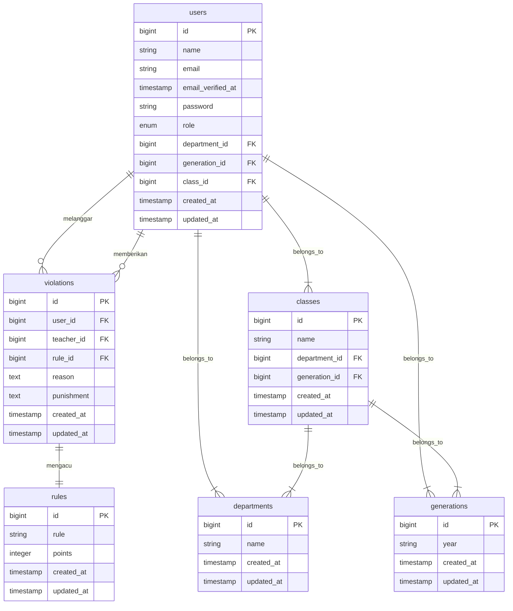

```mermaid
erDiagram
    users ||--o{ violations : "melanggar"
    users ||--o{ violations : "memberikan"
    users ||--|{ departments : "belongs_to"
    users ||--|{ generations : "belongs_to"
    users ||--|{ classes : "belongs_to"
    classes ||--|{ departments : "belongs_to"
    classes ||--|{ generations : "belongs_to"
    violations ||--|| rules : "mengacu"
    
    users {
        bigint id PK
        string name
        string email
        timestamp email_verified_at
        string password
        enum role
        bigint department_id FK
        bigint generation_id FK
        bigint class_id FK
        timestamp created_at
        timestamp updated_at
    }                
    
    departments {
        bigint id PK
        string name
        timestamp created_at
        timestamp updated_at
    }
    
    generations {
        bigint id PK
        string year
        timestamp created_at
        timestamp updated_at
    }
    
    classes {
        bigint id PK
        string name
        bigint department_id FK
        bigint generation_id FK
        timestamp created_at
        timestamp updated_at
    }
    
    rules {
        bigint id PK
        string rule
        integer points
        timestamp created_at
        timestamp updated_at
    }
    
    violations {
        bigint id PK
        bigint user_id FK
        bigint teacher_id FK
        bigint rule_id FK
        text reason
        text punishment
        timestamp created_at
        timestamp updated_at
    }
```
